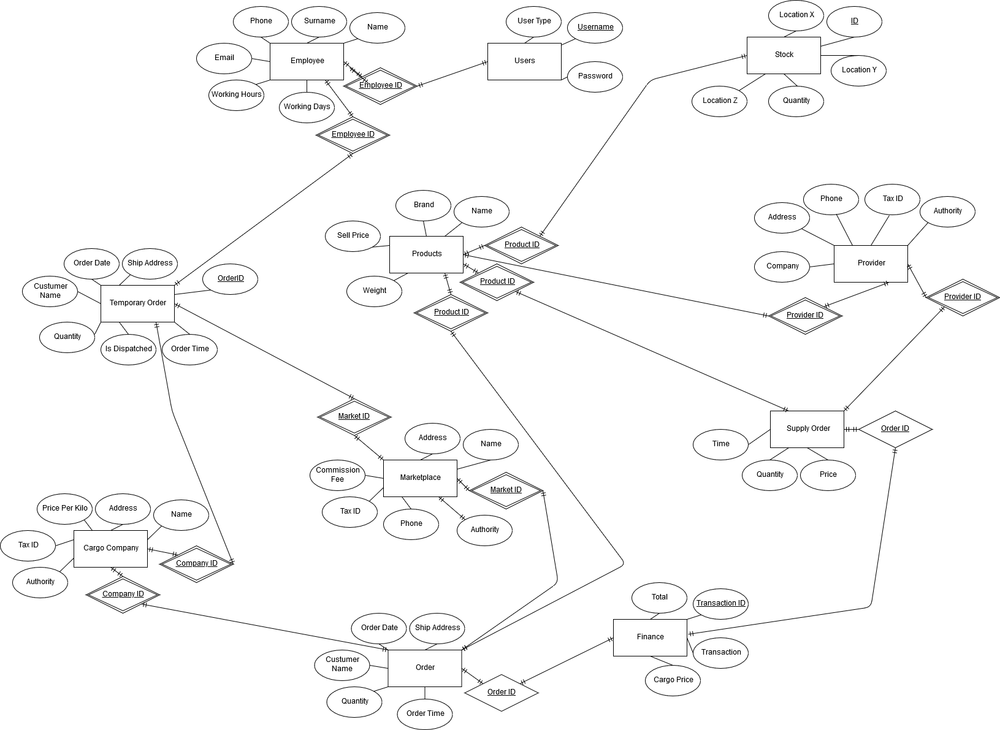

Developer Guide
===============

Database Design
---------------

**This E / R diagram shows the entities in database and their relationships with each other.**

Code
----

In this section we showed the backend part of our code and explained what we did in backend.

.. toctree::

   member1
   member2
   member3
