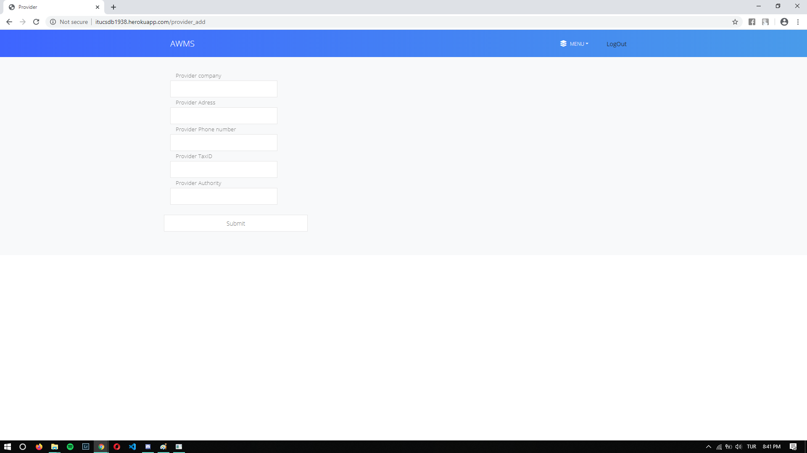
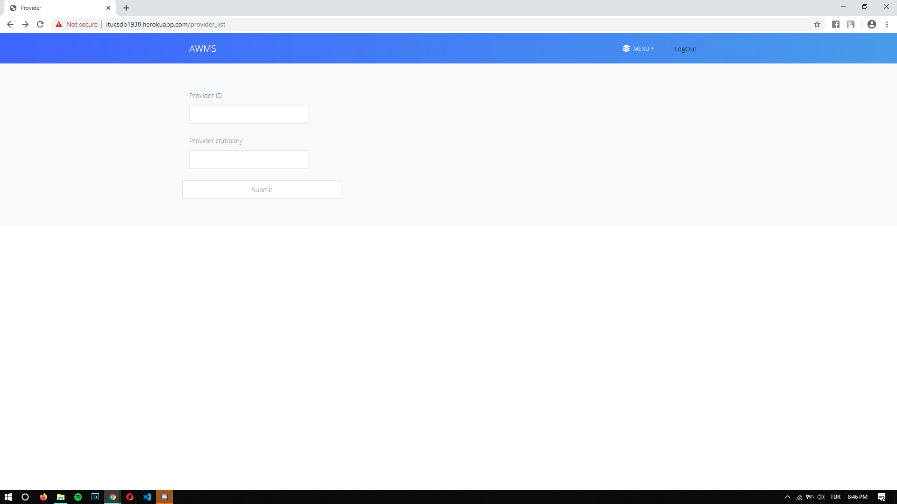
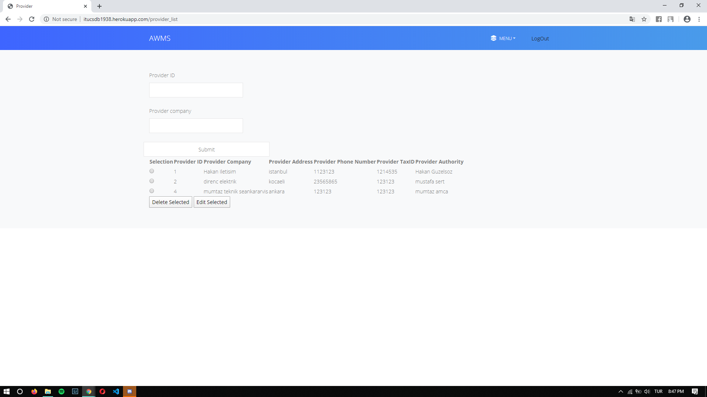

Parts Implemented by Yavuz Ege Okumuş
================================
In this part Provider, CargoCompany and Supply_Order tables are used

In the screenshot above, the provider adding page can be seen. There admins can provide the information of a Provider and add them to database.

In the screenshot above, the provider searching can be seen. There admins can search for the provider by typing in their ID or name or can list them all by typing '*' in the ID section.

 
 
In the screenshot above, the provider list can be seen. There admins can select a provider by checking the radio button next to the row. There admin can choose to edit or delete a provider.
 
 
 .. figure:: provider_edit.png
   :scale: 50 %
   :alt: Provider editing page
   
In the screenshot above, the provider editing page can be seen. There admins can edit the provider they selected in the previous page and submit their changes.
 
