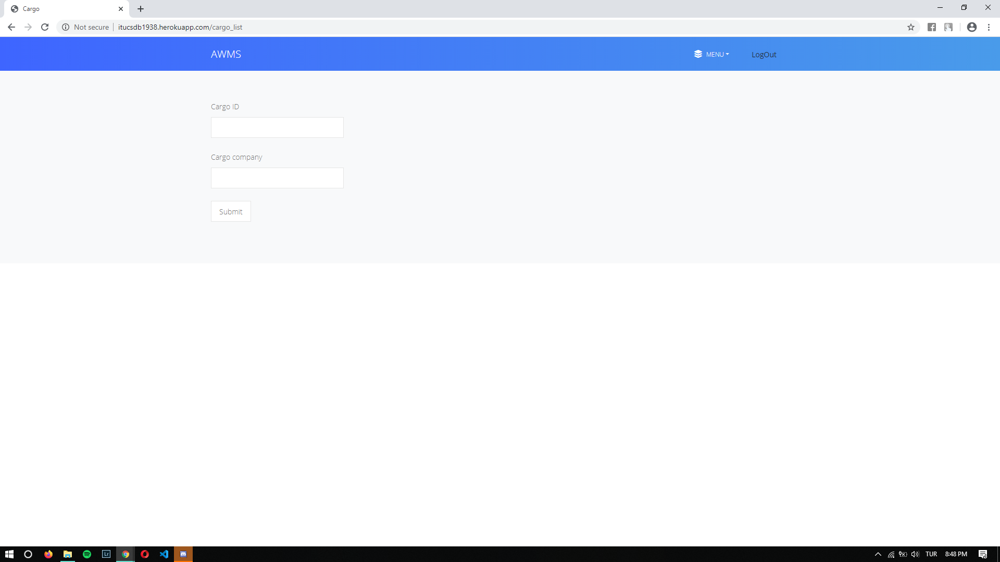
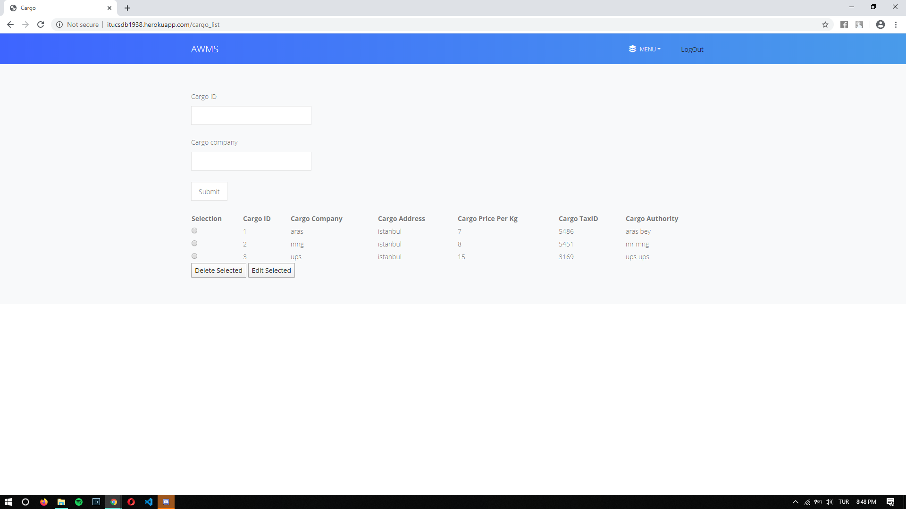
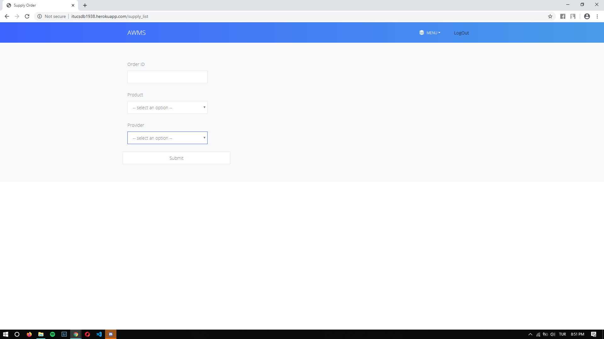
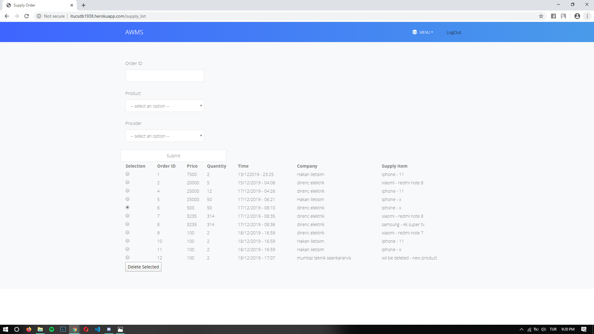

Parts Implemented by Yavuz Ege Okumuş
================================
In this part Provider, CargoCompany and Supply_Order tables are used

.. figure:: provider_add.png
   :scale: 50 %
   :alt: Provider adding page
In the screenshot above, the provider adding page can be seen. There admins can provide the information of a Provider and add them to database.

.. figure:: provider_search.png
   :scale: 50 %
   :alt: Provider searching page
In the screenshot above, the provider searching can be seen. There admins can search for a provider by typing in their ID or name or can list them all by typing '*' in the ID section.

.. figure:: provider_list.png
   :scale: 50 %
   :alt: Provider listing page
 
 
In the screenshot above, the provider list can be seen. There admins can select a provider by checking the radio button next to the row. There admin can choose to edit or delete a provider.
 
 
 .. figure:: provider_edit.png
   :scale: 50 %
   :alt: Provider editing page
   
In the screenshot above, the provider editing page can be seen. There admins can edit the provider they selected in the previous page and submit their changes.
 
 
 .. figure:: cargo_add.png
   :scale: 50 %
   :alt: Cargo Company adding page
In the screenshot above, the cargo company adding page can be seen. There admins can provide the information of a Cargo Company and add them to database.

In the screenshot above, the cargo company searching can be seen. There admins can search for a cargo company by typing in their ID or name or can list them all by typing '*' in the ID section.

 
 
In the screenshot above, the provider list can be seen. There admins can select a provider by checking the radio button next to the row. There admin can choose to edit or delete a provider.

 .. figure:: cargo_edit.png
   :scale: 50 %
   :alt: Provider editing page
   
In the screenshot above, the cargo company editing page can be seen. There admins can edit the cargo company they selected in the previous page and submit their changes.
 

 .. figure:: supply_add.png
   :scale: 50 %
   :alt: Supply Order  page
In the screenshot above, the warehouse can order supplies from an already added provider and indicate which product to order with the information of the price and quantity.

In the screenshot above, the supply searching can be seen. There admins can search for a supply order by typing in their ID or name or can list them all by typing '*' in the ID section. 

In the screenshot above, the supply listing and deleting can be seen. There admins can only view and delete an order since a given order cannot be edited logically but only be deleted due to some errors during ordering. 
