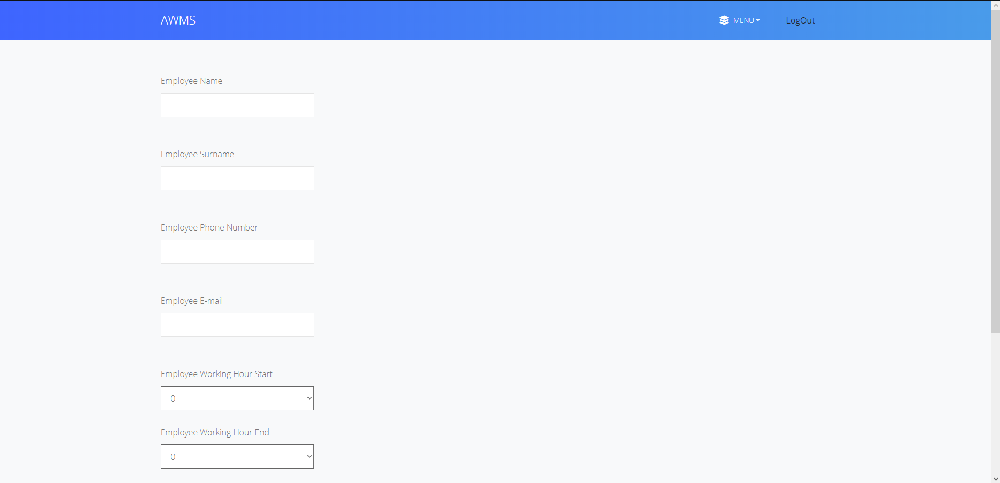
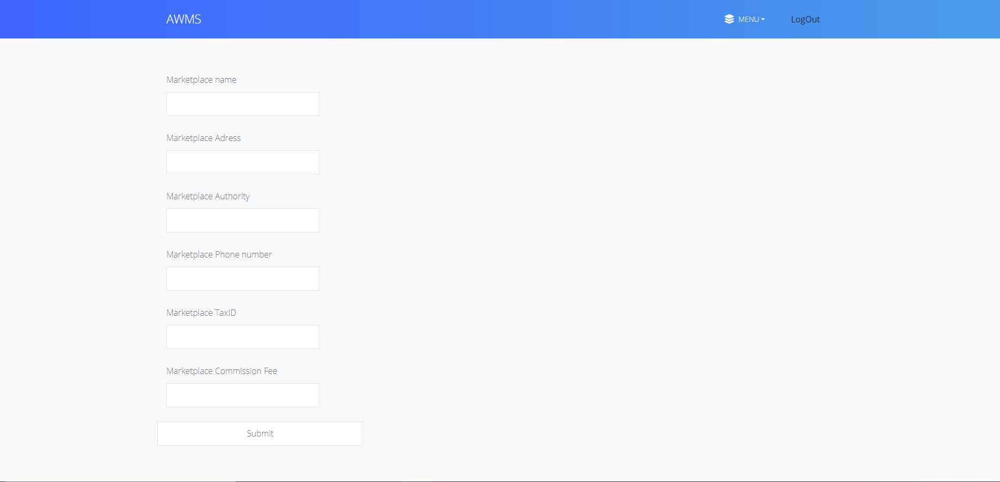

Parts Implemented by Egehan Orta
================================
In this part employee, marketplace and stock tables used.

   

   
In above page, admins of warehouse can add new employee to the system.
   

   
In above page, admins of warehouse can list the employees, edit or delete the selected employee.

   

   
In above page, admins can edit the information about employee.

   
In above page, admins of warehouse can add new marketplaces to the system.

   
In above page, admins of warehouse can list the marketplaces and delete or edit the selected marketplace.

   
In above page, admins of warehouse can edit the information about marketplace.

   
In above page, admins can see the current stock status. Since stocks are updating automatically by supply orders and customer orders, stock does not have an option for deletion or editing.
